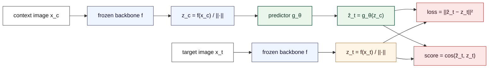
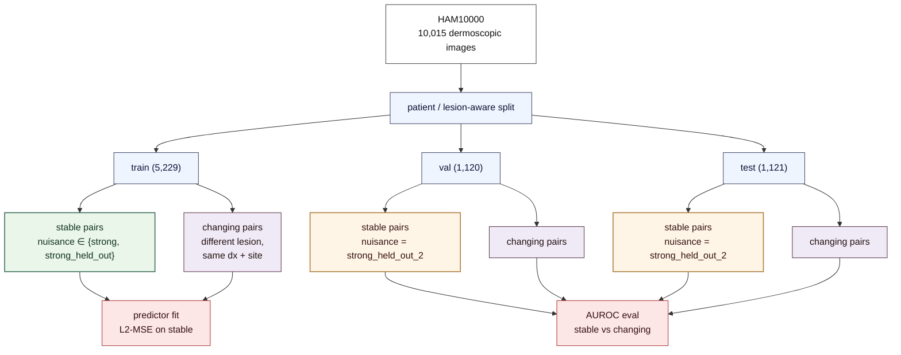
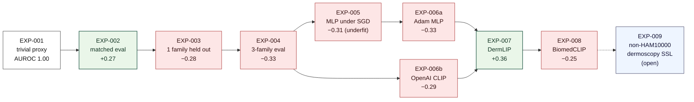

# DermaJEPA

> Frozen-backbone, linear JEPA-style probes for dermoscopic longitudinal-proxy generalisation on HAM10000.

<p align="left">
  <a href="LICENSE"></a>
  <a href="pyproject.toml"></a>
  <a href="tests/"></a>
  <a href="https://github.com/astral-sh/uv"></a>
  <a href="https://pytorch.org"></a>
  <a href="https://huggingface.co/datasets/abdelstark/derma-jepa-runs"></a>
</p>

DermaJEPA tests whether a JEPA-style latent predictor over a *frozen* vision backbone can separate stable lesions under nuisance variation from genuinely changing lesions on a leakage-controlled longitudinal proxy. The repository contains the experiment harness, the configurations, and per-run reports for nine primary-tier experiments on public HAM10000 data.

---

## Contents

- [Headline result](#headline-result)
- [Method](#method)
- [Experimental design](#experimental-design)
- [Pipeline overview](#pipeline-overview)
- [Datasets](#datasets)
- [Backbones evaluated](#backbones-evaluated)
- [Experiment sequence](#experiment-sequence)
- [Reproducing the results](#reproducing-the-results)
- [Repository structure](#repository-structure)
- [Open follow-up](#open-follow-up)
- [Scope](#scope)
- [References](#references)
- [Tooling](#tooling)
- [Citing](#citing)
- [Acknowledgements](#acknowledgements)
- [License](#license)

---

## Headline result

On a leakage-controlled HAM10000 proxy with three disjoint synthetic nuisance families, training on a mixture of two and evaluating on the third unseen family (`strong_held_out_2`), a linear JEPA-style predictor over a frozen vision backbone gives:

| Backbone | Pretraining | HAM10000 in pretrain? | Test AUROC on `strong_held_out_2` | Seeds | Δ vs strongest baseline (pixel L2 = 0.580) |
|---|---|---|---:|---:|---:|
| DINOv2 ViT-B/14 — [`facebook/dinov2-base`](https://huggingface.co/facebook/dinov2-base) | LVD-142M (curated web) | No | 0.249 [0.230, 0.270] | 1 | −0.331 |
| OpenAI CLIP ViT-B/16 — [`openai/clip-vit-base-patch16`](https://huggingface.co/openai/clip-vit-base-patch16) | OpenAI WIT (≈400M web image-text) | No | 0.286 [0.265, 0.310] | 1 | −0.294 |
| BiomedCLIP ViT-B/16 — [`microsoft/BiomedCLIP-PubMedBERT_256-vit_base_patch16_224`](https://huggingface.co/microsoft/BiomedCLIP-PubMedBERT_256-vit_base_patch16_224) | PMC-15M (general biomedical) | No | **0.329 ± 0.012** | 5 | −0.252 |
| **DermLIP ViT-B/16** — [`redlessone/DermLIP_ViT-B-16`](https://huggingface.co/redlessone/DermLIP_ViT-B-16) | **Derm1M (dermatology)** | **Likely yes** | **0.944 ± 0.003** | **5** | **+0.364** |

Frozen natural-image and frozen general-medical backbones produce below-random test AUROC across two architectures (DINOv2, OpenAI CLIP), three predictor scaffolds (linear, underfit MLP, fit MLP under Adam), and two optimisers (SGD, Adam). A frozen dermoscopy-specific backbone (DermLIP, CLIP-trained on Derm1M) lifts test AUROC to 0.944 ± 0.003 across 5 seeds. DermLIP's pretraining corpus almost certainly includes HAM10000, so the contribution of dermoscopy-domain transfer versus HAM10000 image-level overlap is unpartitioned in this nine-run sequence; EXP-009 (a DINOv2 self-pretrained on a non-HAM10000 dermoscopy corpus) is the open follow-up that addresses this.

Per-run reports with reproducible commands, bootstrap CIs, and Hub paths for every run are in [`docs/experiments/`](docs/experiments/README.md). The aggregated cross-run table is in [EXP-008 §9.4](docs/experiments/EXP-008-ham10000-jepa-biomedclip-backbone-v1.md). The seed-sweep summary that locks the DermLIP and BiomedCLIP headlines is in [EXP-007/008 seed-sweep summary](docs/experiments/EXP-007-008-seed-sweep-summary.md).

---

## Method

For each frozen backbone $f$ and each image $x$, we compute $z = f(x) / \lVert f(x) \rVert_2 \in \mathbb{R}^d$. Stable pairs $(x_c, x_t)$ are produced by applying a synthetic nuisance augmentation to a single HAM10000 image; changing pairs use two distinct lesions matched on diagnosis and anatomical site. A predictor $g_\theta : \mathbb{R}^d \to \mathbb{R}^d$ — linear with identity warm-start, or a 2-layer identity-residual MLP — is trained to minimise $\lVert g_\theta(z_c) - z_t \rVert_2^2$ on stable training pairs from two of three disjoint nuisance families (`strong`, `strong_held_out`). Evaluation uses cosine distance between $g_\theta(z_c)$ and $z_t$ on a held-out third family (`strong_held_out_2`); the score should rank changing pairs higher than stable pairs. AUROC is computed with 1,000-sample bootstrap 95 % CIs over groups, alongside AUPRC, equal-error-rate threshold, and FPR at fixed TPR = 0.8. Lesion-ID-aware splits (5,229 / 1,120 / 1,121) prevent within-lesion leakage.



The predictor objective and identity warm-start follow JEPA-style latent prediction ([LeCun, 2022](#references); [Assran et al., 2023](#references)) restricted to the frozen-backbone, single-step, stable-pair subset of the JEPA family. The proxy task and nuisance suite are project-specific.

---

## Experimental design

The proxy task uses three disjoint synthetic nuisance families. Training pairs rotate between two families; evaluation uses the third, never seen during training.



Three nuisance families are designed to be disjoint along the deterministic augmentation axis: `strong` and `strong_held_out` cover orthogonal subsets of (lighting, geometry, colour) operations; `strong_held_out_2` is a third disjoint subset that is never seen during predictor training. A predictor that learns family-agnostic invariance generalises to `strong_held_out_2`; one that learns family-specific directions inverts on it.

---

## Pipeline overview

```mermaid
flowchart LR
    classDef in fill:#fff,stroke:#444,stroke-width:1px,color:#111
    classDef step fill:#eef5ff,stroke:#446,stroke-width:1px,color:#113
    classDef out fill:#eaf6e9,stroke:#365,stroke-width:1.5px,color:#132
    classDef hub fill:#fff5e6,stroke:#a73,stroke-width:1.5px,color:#311

    HAM["HAM10000<br/>(local or hf://datasets mount)"]:::in
    Audit["data audit<br/>derma-jepa data audit"]:::step
    Manifest["manifest build<br/>splits + stable + changing pairs"]:::step
    Embed["embed<br/>frozen backbone → 384/512/768-d vectors"]:::step
    Baseline["baseline eval<br/>pixel L2, SSIM, raw cosine"]:::step
    Train["train<br/>linear / MLP JEPA predictor"]:::step
    Metrics["metrics + bootstrap CIs<br/>AUROC, AUPRC, EER, FPR@TPR"]:::out
    Run["run directory<br/>config, manifests, embeddings,<br/>plots, logs, model card"]:::out
    Hub["HF Hub upload<br/>abdelstark/derma-jepa-runs/&lt;run_id&gt;"]:::hub

    HAM --> Audit --> Manifest --> Embed --> Baseline --> Train --> Metrics --> Run --> Hub
```



The CLI surfaces each step independently; hosted runs on Hugging Face Jobs chain them inside a single launcher script. Source: [`src/derma_jepa/`](src/derma_jepa/), [`scripts/`](scripts/). Run output contract: [`docs/spec/MVP-SPEC.md` §14](docs/spec/MVP-SPEC.md).

---

## Datasets

| Dataset | Use in this repo | Source | Citation |
|---|---|---|---|
| HAM10000 | Primary evaluation corpus (10,015 dermoscopic images, lesion-ID metadata) | [Harvard Dataverse `10.7910/DVN/DBW86T`](https://doi.org/10.7910/DVN/DBW86T) | Tschandl et al., *Sci. Data* 2018 — [`10.1038/sdata.2018.161`](https://doi.org/10.1038/sdata.2018.161) ([arXiv:1803.10417](https://arxiv.org/abs/1803.10417)) |
| Derm1M | Pretraining corpus for the DermLIP backbone (third-party, used as frozen weights) | [DermLIP HF org](https://huggingface.co/redlessone) | Yan et al., *arXiv* 2025 — [arXiv:2503.14911](https://arxiv.org/abs/2503.14911) |
| PMC-15M | Pretraining corpus for the BiomedCLIP backbone (third-party, used as frozen weights) | [BiomedCLIP HF model](https://huggingface.co/microsoft/BiomedCLIP-PubMedBERT_256-vit_base_patch16_224) | Zhang et al., *arXiv* 2023 — [arXiv:2303.00915](https://arxiv.org/abs/2303.00915) |

Run artifacts (manifests, embeddings, metrics, model cards, plots, logs) for every primary-tier run are uploaded to [`abdelstark/derma-jepa-runs`](https://huggingface.co/datasets/abdelstark/derma-jepa-runs) under the run ID listed in the corresponding experiment report. The repository does not vendor HAM10000 images. Hosted runs mount a private Hub mirror at `/data`; see [`data/README.md`](data/README.md) for the layout.

---

## Backbones evaluated

| Model | HF Hub | Architecture | Embed dim | Reference |
|---|---|---|---:|---|
| DINOv2 ViT-S/14 | [`facebook/dinov2-small`](https://huggingface.co/facebook/dinov2-small) | ViT-S/14 | 384 | Oquab et al., *TMLR* 2024 — [arXiv:2304.07193](https://arxiv.org/abs/2304.07193) |
| DINOv2 ViT-B/14 | [`facebook/dinov2-base`](https://huggingface.co/facebook/dinov2-base) | ViT-B/14 | 768 | Oquab et al., *TMLR* 2024 — [arXiv:2304.07193](https://arxiv.org/abs/2304.07193) |
| OpenAI CLIP ViT-B/16 | [`openai/clip-vit-base-patch16`](https://huggingface.co/openai/clip-vit-base-patch16) | ViT-B/16 | 512 | Radford et al., *ICML* 2021 — [arXiv:2103.00020](https://arxiv.org/abs/2103.00020) |
| DermLIP ViT-B/16 | [`redlessone/DermLIP_ViT-B-16`](https://huggingface.co/redlessone/DermLIP_ViT-B-16) | ViT-B/16 (CLIP arch., Derm1M-CLIP-trained) | 512 | Yan et al., *arXiv* 2025 — [arXiv:2503.14911](https://arxiv.org/abs/2503.14911) |
| BiomedCLIP ViT-B/16 | [`microsoft/BiomedCLIP-PubMedBERT_256-vit_base_patch16_224`](https://huggingface.co/microsoft/BiomedCLIP-PubMedBERT_256-vit_base_patch16_224) | ViT-B/16 (CLIP arch., PMC-15M-CLIP-trained) | 512 | Zhang et al., *arXiv* 2023 — [arXiv:2303.00915](https://arxiv.org/abs/2303.00915) |

Loaders: DINOv2 via [`transformers`](https://github.com/huggingface/transformers), OpenAI CLIP via `transformers`, DermLIP and BiomedCLIP via [`open_clip`](https://github.com/mlfoundations/open_clip) (`hf-hub:` prefix; [Cherti et al., *CVPR* 2023](https://arxiv.org/abs/2212.07143)). Implementation in [`src/derma_jepa/embeddings.py`](src/derma_jepa/embeddings.py).

---

## Experiment sequence

The arc is structured as a falsification ladder: each experiment isolates one axis (predictor class, optimiser, backbone, pretraining-data domain) and tests whether the previous run's failure mode was caused by that axis.



Δ values are vs the strongest cheap baseline (pixel L2 from EXP-004 onward). Full per-run details and Hub links: [`docs/experiments/README.md`](docs/experiments/README.md).

---

## Reproducing the results

### Local environment

```bash
git clone https://github.com/AbdelStark/derma-jepa
cd derma-jepa
uv sync --extra dev --extra model
```

[`uv`](https://github.com/astral-sh/uv) provides reproducible installs. The optional `model` extras pull `torch`, `torchvision`, `timm`, `transformers`, and `open_clip_torch`. Hosted-job dependency pins live in [`scripts/hf_jobs_constraints.txt`](scripts/hf_jobs_constraints.txt).

### Validate the codebase

```bash
uv run ruff check .
uv run ruff format --check .
uv run mypy
uv run pytest -q
```

Acceptance: 33 tests pass; 2 model-extras tests skip cleanly when `torch` is unavailable.

### Reproduce a single primary-tier run

Each experiment has a self-contained launcher under [`scripts/`](scripts/) that pins config path, install extras, dataset mount, GPU flavor, and timeout:

```bash
DERMA_JEPA_RUN_ID=<your-run-id> ./scripts/hf_jobs_ham10000_exp007.sh
# or exp006a / exp006b / exp008 / etc.
```

Inside the Job: `derma-jepa manifest build → embed → baseline eval → train`. Output is uploaded to `hf://datasets/$HF_OUTPUT_REPO_ID/<run-id>/`. Pull and summarise:

```bash
uv run --with "huggingface-hub>=1.0" derma-jepa hf-run summary \
  --repo-id abdelstark/derma-jepa-runs \
  --run-id <run-id>
```

### Reproduce the seed sweep (5 seeds × 2 configs)

```bash
for SEED in 1 2 3 4; do
  BASE_CONFIG=configs/data/ham10000_hf_mounted_exp007.yaml \
  SEED=$SEED SWEEP_TAG=dermlip-exp007 \
    ./scripts/hf_jobs_seed_sweep.sh
done

uv run python scripts/aggregate_seed_sweep.py \
  --label "EXP-007 DermLIP" \
  --run-id ham10000-hf-dermlip-exp007-v1 \
  --run-id ham10000-hf-dermlip-exp007-seed-1-v1 \
  --run-id ham10000-hf-dermlip-exp007-seed-2-v1 \
  --run-id ham10000-hf-dermlip-exp007-seed-3-v1 \
  --run-id ham10000-hf-dermlip-exp007-seed-4-v1
```

The aggregator reports per-seed AUROC plus across-seed mean / std / min / max / 95 % CI[mean]. Replace `dermlip-exp007` with `biomedclip-exp008` for the BiomedCLIP cell.

### Local fixture pipeline (no GPU, no public data)

For wiring verification without HAM10000:

```bash
uv run derma-jepa fixture pipeline --config configs/manifest/fixture.yaml
```

Generates a fixture run directory under `runs/fixture-contract-v1/` and a portable demo bundle under `artifacts/demo/fixture-contract-v1/`.

---

## Repository structure

```
src/derma_jepa/         # package: CLI, manifest contracts, baselines, embeddings, training, hf-run helpers, demo export
configs/manifest/       # fixture-tier deterministic configs
configs/data/           # HAM10000 audit and per-experiment proxy configs (ham10000_hf_mounted_exp00*.yaml)
configs/train/          # JEPA predictor training configs
scripts/                # HF Jobs launchers (one per experiment), seed-sweep launcher, aggregator
tests/                  # contract, metric, end-to-end fixture pipeline, training, observability
docs/experiments/       # one self-contained Markdown report per primary-tier run
docs/runbooks/          # operational playbooks (HF Jobs, HAM10000 JEPA loop)
data/README.md          # data layout, leakage rules, citations
```

---

## Open follow-up

EXP-009 — self-pretrain a DINOv2 ViT-B/14 on a non-HAM10000 dermoscopy corpus (ISIC archives minus HAM10000, DermNet, BCN20000 non-HAM10000 components, etc.) for a short JEPA-style or MIM objective and re-run the EXP-004 recipe on top. This partitions dermoscopy-domain transfer from HAM10000 image-level overlap, which is the central caveat on EXP-007's headline. Decision framework in [EXP-008 §7](docs/experiments/EXP-008-ham10000-jepa-biomedclip-backbone-v1.md).

---

## Scope

In scope:

- Public-data audit and longitudinal-proxy construction on HAM10000.
- Linear and small MLP JEPA-style predictors over frozen vision backbones.
- Pixel L2, SSIM, and frozen-embedding-cosine baselines.
- Bootstrap CI evaluation, leakage probes, fixed-TPR / EER reporting.
- Reproducible Hugging Face Jobs launchers and a public run-archive convention.

Out of scope:

- Diagnostic or treatment recommendations.
- Production medical-device claims.
- JEPA pretraining of the backbone from scratch.
- Real longitudinal data; HAM10000 is cross-sectional and the proxy is synthetic throughout.

This is a research artefact, not diagnostic, not medical advice, and not validated for patient use.

---

## References

- Assran, M., Duval, Q., Misra, I., Bojanowski, P., Vincent, P., Rabbat, M., LeCun, Y. and Ballas, N. *Self-Supervised Learning from Images with a Joint-Embedding Predictive Architecture* (I-JEPA). CVPR 2023. [arXiv:2301.08243](https://arxiv.org/abs/2301.08243).
- Cherti, M., Beaumont, R., Wightman, R., Wortsman, M., Ilharco, G., Gordon, C., Schuhmann, C., Schmidt, L. and Jitsev, J. *Reproducible scaling laws for contrastive language-image learning* (OpenCLIP). CVPR 2023. [arXiv:2212.07143](https://arxiv.org/abs/2212.07143).
- LeCun, Y. *A Path Towards Autonomous Machine Intelligence*. OpenReview, 2022. [PDF](https://openreview.net/pdf?id=BZ5a1r-kVsf).
- Oquab, M. et al. *DINOv2: Learning Robust Visual Features without Supervision*. TMLR 2024. [arXiv:2304.07193](https://arxiv.org/abs/2304.07193).
- Radford, A. et al. *Learning Transferable Visual Models From Natural Language Supervision* (CLIP). ICML 2021. [arXiv:2103.00020](https://arxiv.org/abs/2103.00020).
- Tschandl, P., Rosendahl, C. and Kittler, H. *The HAM10000 dataset, a large collection of multi-source dermatoscopic images of common pigmented skin lesions*. *Scientific Data* 5, 180161 (2018). [doi:10.1038/sdata.2018.161](https://doi.org/10.1038/sdata.2018.161); [arXiv:1803.10417](https://arxiv.org/abs/1803.10417).
- Yan, S. et al. *Derm1M: A Million-scale Vision-Language Dataset for Dermatology Foundation Models* (DermLIP, PanDerm). arXiv 2025. [arXiv:2503.14911](https://arxiv.org/abs/2503.14911).
- Zhang, S. et al. *BiomedCLIP: a multimodal biomedical foundation model pretrained from fifteen million scientific image-text pairs*. arXiv 2023. [arXiv:2303.00915](https://arxiv.org/abs/2303.00915).

---

## Tooling

[PyTorch](https://pytorch.org), [transformers](https://github.com/huggingface/transformers), [open_clip](https://github.com/mlfoundations/open_clip), [timm](https://github.com/huggingface/pytorch-image-models), [scikit-image](https://scikit-image.org/), [scikit-learn](https://scikit-learn.org/), [pyarrow](https://arrow.apache.org/docs/python/), [Typer](https://typer.tiangolo.com/), [uv](https://github.com/astral-sh/uv), [Hugging Face Jobs](https://huggingface.co/docs/huggingface_hub/main/en/guides/cli#run-a-job).

---

## Citing

If you use this code or the run archive, please cite:

```bibtex
@misc{bakhta2026dermajepa,
  author = {Bakhta, Abdelhamid},
  title  = {DermaJEPA: Frozen-backbone JEPA-style probes for dermoscopic
            longitudinal-proxy generalisation on HAM10000},
  year   = {2026},
  url    = {https://github.com/AbdelStark/derma-jepa},
  note   = {Run archive: \url{https://huggingface.co/datasets/abdelstark/derma-jepa-runs}}
}
```

When citing a specific experiment, also reference the run ID (e.g. `ham10000-hf-dermlip-exp007-v1`) and the corresponding report under [`docs/experiments/`](docs/experiments/README.md).

---

## Acknowledgements

This project depends on weights and datasets released by Meta AI Research (DINOv2), OpenAI (CLIP), Microsoft Research (BiomedCLIP, PubMedBERT), the DermLIP / PanDerm authors and the Derm1M corpus, and the HAM10000 authors and Harvard Dataverse. Hosted compute via Hugging Face Jobs; bootstrap CI implementation follows scikit-learn conventions. All errors are mine.

---

## License

This repository is released under the [MIT License](LICENSE). Copyright © 2026 Abdelhamid Bakhta. Third-party model weights and datasets retain their own licences (CC-BY-NC 4.0 for DermLIP; MIT for BiomedCLIP; the HAM10000 dataset terms; the DINOv2 and OpenAI CLIP weight licences). Verify each upstream licence before downstream use.
